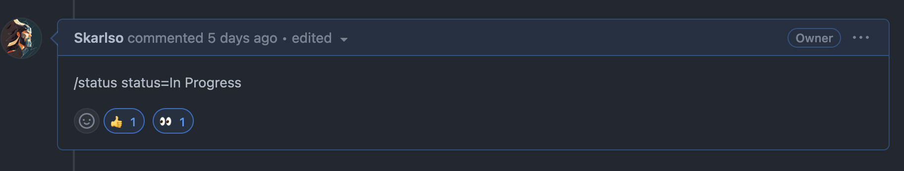
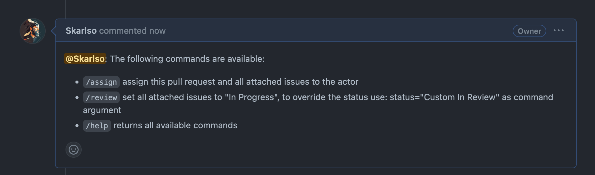

# Caretaker


Caretaker automates project ( beta ) based processes.

The following automation options are available at the moment of writing.

| :boom: WARNING                                                                                                                                                            |
|:--------------------------------------------------------------------------------------------------------------------------------------------------------------------------|
| Since this action can modify your organization's Project board and issue status it is recommended that you restrict access to it to organization members and maintainers. |

For example, don't allow this action to be executed on Forks of the repository.

| :bulb: NOTE                                                                     |
|:--------------------------------------------------------------------------------|
| Caretaker allows for a maximum of 10 projects being assigned to a single Issue. |

## Periodic pull request scanning

Caretaker can track pull request activity. It does that by checking the last activity on the pull request.
It compares that date with an interval set by the user, by default 24 hours. If the last activity was later than that,
it will automatically move any issues that are attached to the pull request into a desired **Status** ( column on a board view ).

An example action could look something like this:

```yaml
name: Scan Pull Request Activity

on:
  schedule:
    - cron:  '0 1 * * *'

permissions:
  contents: read
  issues: read

jobs:
  scan:
    runs-on: ubuntu-latest
    steps:
      - name: scan pull request activity
        uses: skarlso/caretaker@v0.1.1
        with:
          command: scan
          owner: skarlso
          repo: test
          token: ${{ secrets.PROJECT_TOKEN }}
          statusOption: In Review # this needs to be an option you want the issue to land in
          pullRequestProcessedLabel: caretaker-checked # a label to mark the pull request as seen
```

If the owner of the repository is an organization, please set `isOrganization: true` in `with`.

| :bulb: Note                                                                                                                                                                                                |
|:-----------------------------------------------------------------------------------------------------------------------------------------------------------------------------------------------------------|
| Caretaker comments back into a PR if it finished processing it. In order to avoid triggering the flip back flow, either ignore the actor or set up the flip flow with only pulling and submitting reviews. |

This comment can be disabled by defining `noComment: true` in the `with` section.

### Required Labels

Caretaker checks for a specific label to be present on the Pull Request it already checked, so it can skip it.
This label can be defined via `with: pullRequestProcessedLabel`. This label is _deleted_ during
[Automatic Issue back-flipping on pull request activity](#automatic-issue-back-flipping-on-pull-request-activity).

## Automatic Issue back-flipping on pull request activity

With the following action, Caretaker can flip-back issues into a desired state upon any activity on a pull request.
The activity type can be defined by the action.

```yaml
name: Flip-back issues to In Progress

on:
  pull_request: {}

jobs:
  flip:
    runs-on: ubuntu-latest
    steps:
      - name: flip any related issues
        uses: skarlso/caretaker@v0.1.1
        with:
          command: pull-request-updated
          owner: skarlso
          repo: test
          token: ${{ secrets.PROJECT_TOKEN }}
          statusOption: In Progress # this needs to be an option you want the issue to land in
          pullRequestNumber: ${{ github.event.pull_request.number }}
```

## Assigning Issues created to a Project

You can auto assign any issues that are created to a specific Project.

```yaml
name: Assign to Project

on:
  issues:
    types: [opened]

permissions:
  contents: read
  issues: read

jobs:
  assign:
    runs-on: ubuntu-latest
    steps:
      - name: assign issue to project
        uses: skarlso/caretaker@v0.1.1
        with:
          command: assign-issue
          owner: skarlso
          repo: test
          token: ${{ secrets.PROJECT_TOKEN }}
          issueNumber: ${{ github.event.issue.number }}
          projectNumber: 2 # the number of the project to assign this issue to.
```

_Note_: This will be further extended to add potential default labels to the issue automatically after its creation.

## Update Issue State

There is also a separate command that can be used during any other action regardless of context.
`update-issue` can be used to set the Status of an issue.

## Authentication

Since ProjectV2 at the time of this writing, isn't in the scope of the GITHUB_TOKEN, a generated token must be used with
`org` level read access.

## Slash Commands

In order to trigger a slash command, leave a comment on a pull request like this:

```
/assign
/status
/help
```

Multiple commands can be defined using `\n` delimiter.

Caretaker will acknowledge any comment that has a slash command in it that it recognised. Then, once it's done, it will
react with a thumbs up. Like this:



If a command requires or takes arguments, those can be provided via a space separated list.

```
/status status=In Progress,v=1 
```

To set up Slash commands configure a GitHub action like this:

```yaml
name: Watch for Slash commands.

on: issue_comment

jobs:
  pr_commented:
    # This job only runs for pull request comments
    name: PR comment
    if: ${{ github.event.issue.pull_request }}
    steps:
      - name: watch for slash commands from users
        uses: skarlso/caretaker@v0.2.0
        with:
          command: slash
          owner: skarlso
          repo: test
          token: ${{ secrets.PROJECT_TOKEN }}
          pullRequestNumber: ${{ github.event.pull_request.number }}
          actor: ${{ github.actor }}
          commentBody: ${{ github.event.comment.body }}
          commentID: ${{ github.event.comment.node_id }} # used for applying reactions
```

To see what commands are available, simply comment on a pull request `/help` which should result in something like this:


## Up-coming

For any other features which might be of use, please create a `Feature Request`.
